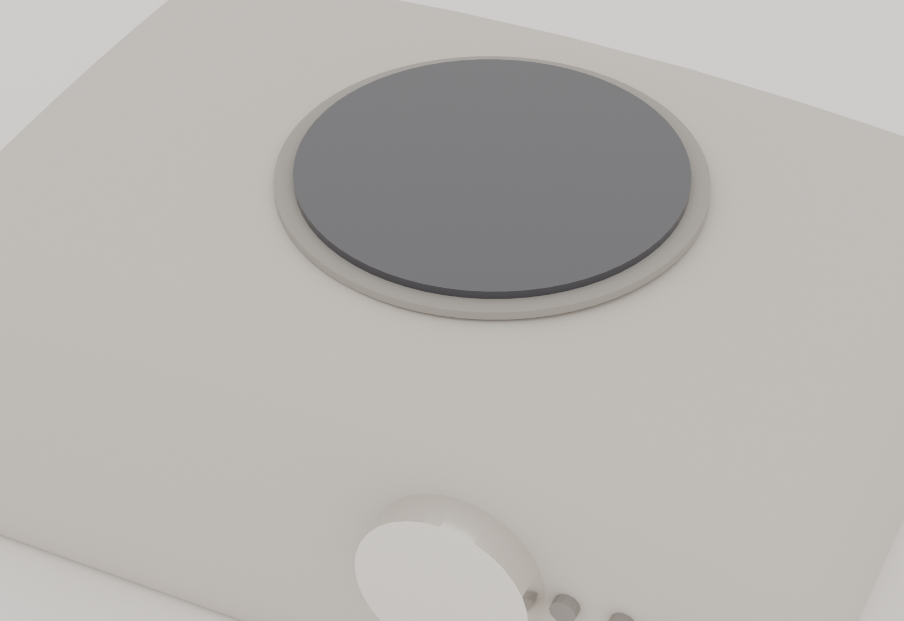

<div align="center">



# TOPIKO

**Ein offline Sprachnotiz-Gerät auf Basis von Edge-KI — ohne Cloud, ohne Konto, ohne Abo.**

[](LICENSE)
[](LICENSE-hardware.md)

</div>

---

## Was ist TOPIKO?

TOPIKO ist ein handtellergroßes Gerät, in das man kurze Sprachnotizen spricht. Diese werden **vollständig lokal** in Text umgewandelt und von einem kleinen Sprachmodell in Kategorien wie Termin, To-do, Erinnerung, Idee oder Tagebuch einsortiert — es verlässt kein einziges Byte das eigene Netzwerk. Kein Cloud-Dienst, kein Mikrofon, das dauerhaft mithört, keine Konten.

Das Projekt entstand im Rahmen einer Masterarbeit zum Thema *„Edge-KI als nachhaltige Alternative zu Cloud-KI"* und ist als offene Bauanleitung gedacht: 3D-Daten, Firmware, Serversoftware und Dokumentation sind frei verfügbar.

Das Interface ist bewusst **wortlos**: Das Display strahlt durch eine transluzente Gehäuseschicht, ein weicher Lichtkörper reagiert in Echtzeit auf die Stimme, und Zustände werden nur über Farbe und Bewegung ausgedrückt.

## Systemüberblick

TOPIKO besteht aus zwei Komponenten, die über WLAN miteinander sprechen:

| Komponente | Hardware | Aufgabe |
|------------|----------|---------|
| **Handheld** | Waveshare ESP32-S3-Touch-AMOLED-1.75 | Aufnahme per Touch, Visualisierung, Upload der Sprachnotiz |
| **Dock** | Arduino UNO Q (Debian Linux) | Transkription (Whisper) + Klassifizierung (lokales LLM) |

```
   ┌──────────────┐    WLAN / WAV-Upload     ┌────────────────────┐
   │   Handheld    │ ───────────────────────▶ │        Dock         │
   │  ESP32-S3     │                           │     Arduino UNO Q   │
   │  AMOLED,Mikro │ ◀─────────────────────── │  Whisper + LLM      │
   └──────────────┘   JSON-Ergebnis zurück     └────────────────────┘
```

Das Handheld nimmt auf Tastendruck bis zu 20 s Audio auf, legt es in eine lokale Warteschlange und lädt es hoch, sobald das Dock erreichbar ist. Das Dock transkribiert mit `whisper.cpp` und klassifiziert mit einem kleinen, quantisierten Sprachmodell (llama.cpp). Das Ergebnis kommt als JSON zurück und wird am Gerät über einen Kategorie-Farbpuls angezeigt.

## Funktionen

- **100 % offline** — Transkription und Klassifizierung laufen lokal auf dem Dock.
- **Push-to-talk** — Touch halten, sprechen, loslassen. Kein Wake-Word, kein Dauerlauschen.
- **Wortloses Licht-Interface** — der Lichtkörper atmet mit der Stimme; Kategorien und Zustände über Farbe.
- **Robuste Warteschlange** — Notizen werden lokal gepuffert und automatisch hochgeladen, sobald das Dock da ist.
- **Stromsparend** — Deep-Sleep nach Inaktivität, konfigurierter AXP2101-Laderegler.
- **Offene Hardware** — 3D-druckbares Gehäuse, Standard-Bauteile, unter ~100 €.

## Repo-Struktur

```
topiko/
├── firmware/topiko_handheld/   ESP32-S3-Firmware (Arduino) inkl. ES7210/ES8311-Treiber
├── software/                   Dock-Software für den Arduino UNO Q (Flask + Whisper + LLM)
├── hardware/
│   ├── 3d/                     Druckbare STL (Gehäuse Ober-/Unterteil)
│   └── cad/                    CAD-Quelldateien (STEP, alle Bauteile)
├── docs/
│   ├── aufbau.md               Hardware-Aufbau: drucken, montieren, flashen
│   ├── software-installation.md  Dock einrichten (Whisper, LLM, App)
│   └── TOPIKO_Anleitung_IKEA.pdf  Bebilderte Kurz-Bauanleitung
└── media/                      Fotos, Renderings, Logo
```

## Schnellstart

1. **Hardware bauen** → [`docs/aufbau.md`](docs/aufbau.md): Gehäuse drucken, Bauteile montieren, Firmware flashen.
2. **Dock einrichten** → [`docs/software-installation.md`](docs/software-installation.md): Whisper + Sprachmodell + App auf dem UNO Q installieren.
3. Handheld einschalten, WLAN/Dock verbinden, Touch halten und sprechen.

## Stückliste (Kurzfassung)

| Bauteil | Hinweis |
|---------|---------|
| Waveshare ESP32-S3-Touch-AMOLED-1.75 | Handheld-Rechner mit Display, Mikro-Array, Touch, AXP2101 |
| Arduino UNO Q (2 GB) | Dock, führt Whisper + LLM aus |
| LiPo-Akku 3,7 V (~320–500 mAh) | flach, für den mobilen Betrieb |
| Lautsprecher (MX1.25) | Bestätigungstöne |
| TTP223 Touch-Sensor | Auslöser im Gehäuse |
| Gewindeeinsätze M2.5 + Schrauben M2.5×7 | Verschraubung |
| Transluzentes + opakes PLA | Gehäuse (Display scheint durch) |

Detaillierte Liste und Montage: [`docs/aufbau.md`](docs/aufbau.md).

## Lizenz

- **Software / Firmware:** [MIT](LICENSE)
- **Hardware, 3D-Daten, Dokumentation:** [CC BY-SA 4.0](LICENSE-hardware.md)

Kurz: frei nutzen, verändern und weitergeben. Bei Hardware/Doku bitte Namensnennung und Weitergabe unter gleichen Bedingungen.

---

<div align="center">
<sub>TOPIKO — Edge-KI als nachhaltige Alternative zu Cloud-KI.</sub>
</div>
